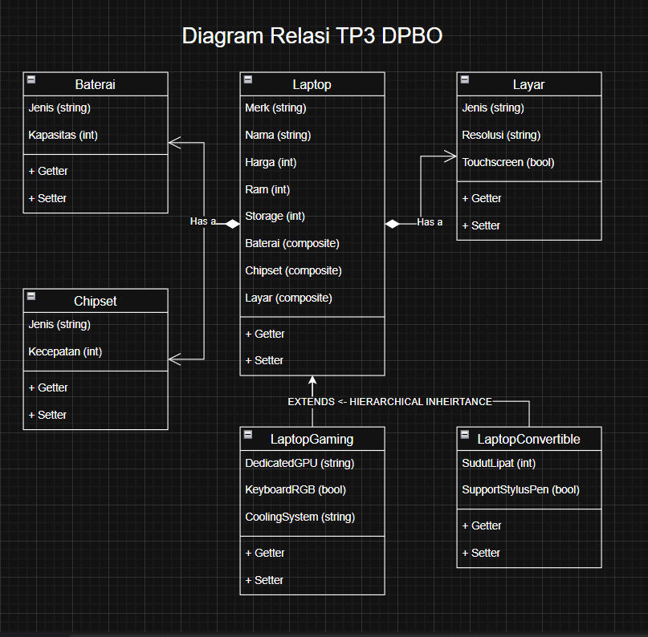
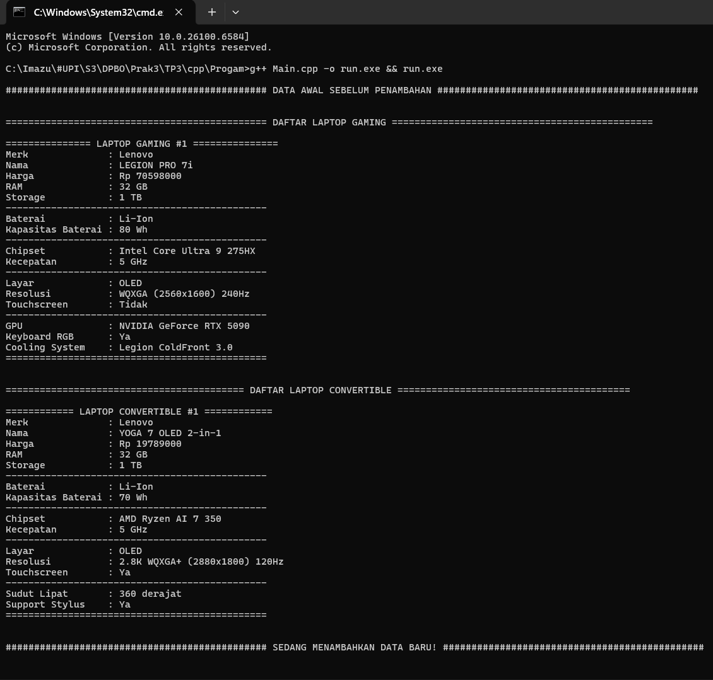
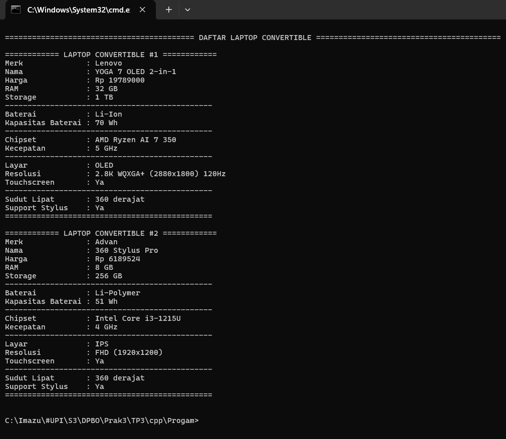
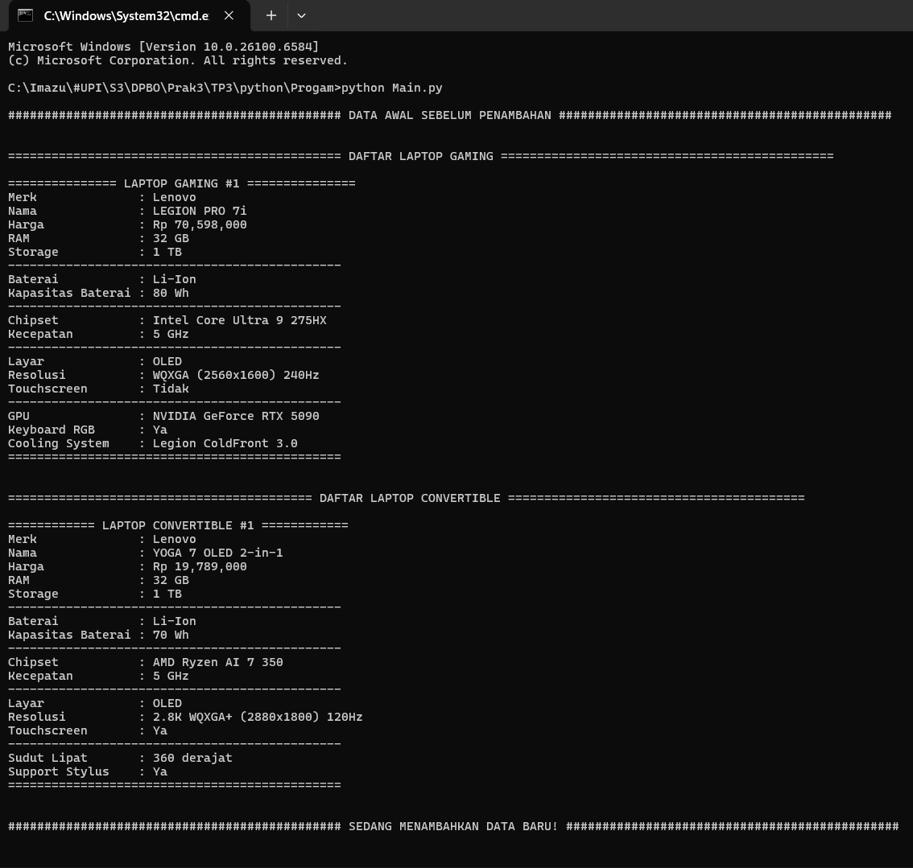
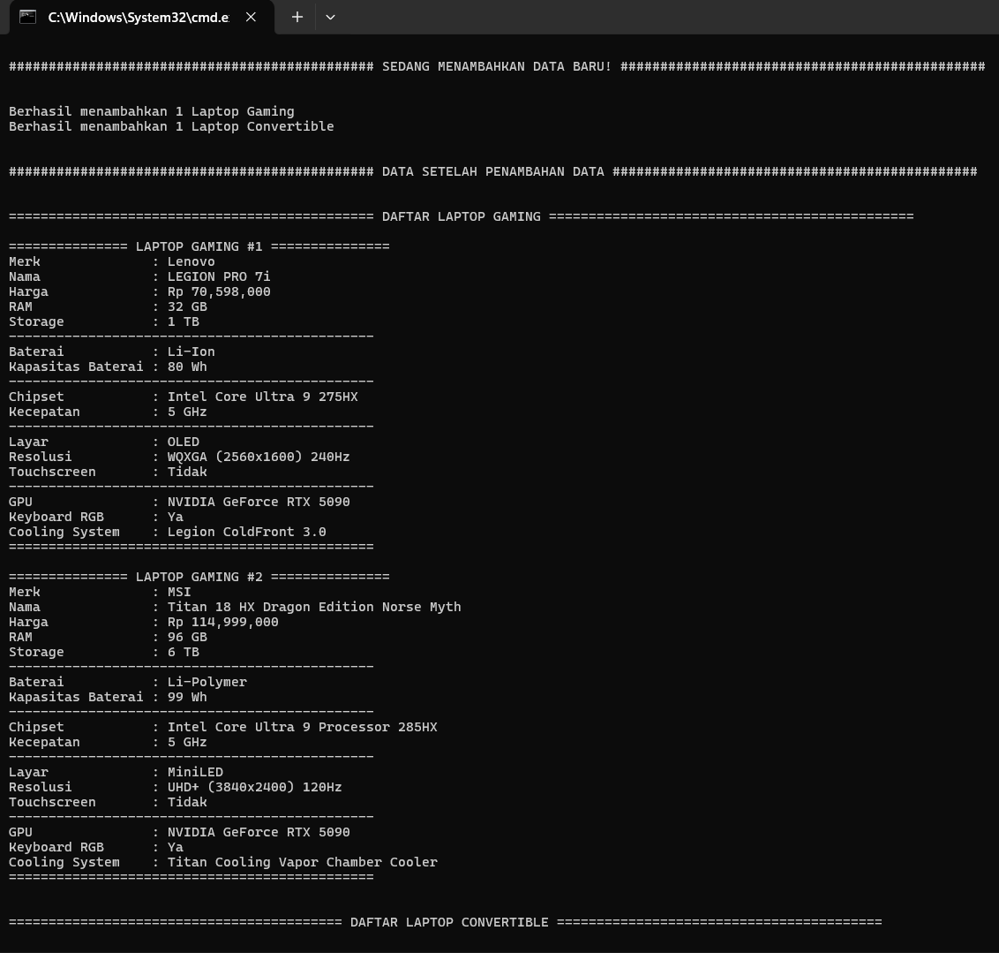
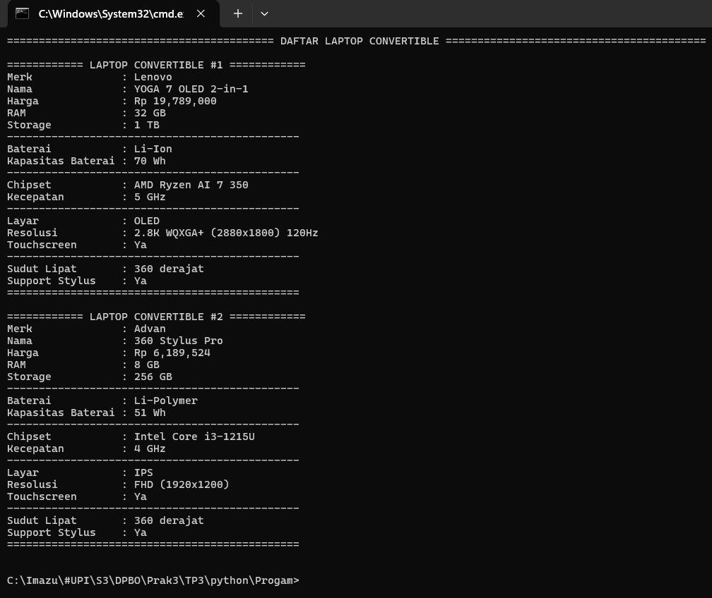

# 💻 TP3 DPBO - Imam Azizun Hakim - 2404420

## 🤝 Janji
"Saya Imam Azizun Hakim dengan NIM 2404420 mengerjakan Tugas Praktikum 3 dalam mata kuliah Desain Pemrograman Berorientasi Objek untuk keberkahan-Nya maka saya tidak akan melakukan kecurangan seperti yang telah di spesifikasikan. Aamiin."

## 🔀 Penjelasan Desain dan Kode Flow
- Menggunakan 6 class bernama **_Laptop_**, **_Baterai_**, **_Chipset_**, **_Layar_**, **_LaptopGaming_** dan **_LaptopConvertible_**

### Class Laptop
- Atribut **_Laptop_** :
<pre>
  ● merk       <strong>Merk laptop berupa String</strong>
  ● nama       <strong>Nama model laptop berupa String</strong>
  ● harga      <strong>Harga laptop berupa Integer</strong>
  ● ram        <strong>Kapasitas RAM berupa Integer (GB)</strong>
  ● storage    <strong>Kapasitas storage berupa Integer (GB)</strong>
  ● baterai    <strong>Object Baterai (Composition)</strong>
  ● chipset    <strong>Object Chipset (Composition)</strong>
  ● layar      <strong>Object Layar (Composition)</strong>
</pre>
- Method **_Laptop_** :
<pre>
  ● Constructor   <strong>Untuk membuat objek Laptop yang baru</strong>
  ● Getter        <strong>Mengambil nilai atribut</strong>
  ● Setter        <strong>Mengubah nilai atribut</strong>
</pre>

### Class Baterai
- Atribut **_Baterai_** :
<pre>
  ● jenis      <strong>Jenis baterai berupa String (Li-Ion, Li-Polymer)</strong>
  ● kapasitas  <strong>Kapasitas baterai berupa Integer (Wh)</strong>
</pre>
- Method **_Baterai_** :
<pre>
  ● Constructor   <strong>Untuk membuat objek Baterai yang baru</strong>
  ● Getter        <strong>Mengambil nilai atribut</strong>
  ● Setter        <strong>Mengubah nilai atribut</strong>
</pre>

### Class Chipset
- Atribut **_Chipset_** :
<pre>
  ● jenis      <strong>Jenis chipset berupa String (Intel, AMD)</strong>
  ● kecepatan  <strong>Kecepatan chipset berupa Integer (GHz)</strong>
</pre>
- Method **_Chipset_** :
<pre>
  ● Constructor   <strong>Untuk membuat objek Chipset yang baru</strong>
  ● Getter        <strong>Mengambil nilai atribut</strong>
  ● Setter        <strong>Mengubah nilai atribut</strong>
</pre>

### Class Layar
- Atribut **_Layar_** :
<pre>
  ● jenis        <strong>Jenis layar berupa String (IPS, OLED, MiniLED)</strong>
  ● resolusi     <strong>Resolusi layar berupa String</strong>
  ● touchscreen  <strong>Status touchscreen berupa Boolean</strong>
</pre>
- Method **_Layar_** :
<pre>
  ● Constructor   <strong>Untuk membuat objek Layar yang baru</strong>
  ● Getter        <strong>Mengambil nilai atribut</strong>
  ● Setter        <strong>Mengubah nilai atribut</strong>
</pre>

### Class LaptopGaming
- Atribut **_LaptopGaming_** :
<pre>
  ● dedicatedGPU    <strong>GPU khusus berupa String (NVIDIA, AMD)</strong>
  ● keyboardRGB     <strong>Status keyboard RGB berupa Boolean</strong>
  ● coolingSystem   <strong>Sistem pendingin berupa String</strong>
</pre>
- Method **_LaptopGaming_** :
<pre>
  ● Constructor   <strong>Untuk membuat objek LaptopGaming yang baru</strong>
  ● Getter        <strong>Mengambil nilai atribut</strong>
  ● Setter        <strong>Mengubah nilai atribut</strong>
</pre>

### Class LaptopConvertible
- Atribut **_LaptopConvertible_** :
<pre>
  ● sudutLipat        <strong>Sudut lipat maksimal berupa Integer (derajat)</strong>
  ● supportStylusPen  <strong>Dukungan stylus pen berupa Boolean</strong>
</pre>
- Method **_LaptopConvertible_** :
<pre>
  ● Constructor   <strong>Untuk membuat objek LaptopConvertible yang baru</strong>
  ● Getter        <strong>Mengambil nilai atribut</strong>
  ● Setter        <strong>Mengubah nilai atribut</strong>
</pre>

### Diagram
  
- Hierarchical Inheritance : LaptopGaming dan LaptopConvertible extends Laptop
  * Parent : Laptop
  * Anak : LaptopGaming dan LaptopConvertible

- Penjelasan:
  * Laptop sebagai parent class memiliki atribut dasar yang dimiliki semua jenis laptop (merk, nama, harga, ram, storage, dll).
  * LaptopGaming mewarisi semua atribut dan method dari Laptop, ditambah atribut khusus untuk gaming seperti dedicatedGPU, keyboardRGB, dan coolingSystem.
  * LaptopConvertible mewarisi semua atribut dan method dari Laptop, ditambah atribut khusus untuk convertible seperti sudutLipat dan supportStylusPen.
  * Dengan inheritance ini, kita dapat menggunakan polimorfisme dan code reusability.

- Composition (HAS-A Relationship)
  * Laptop HAS-A Baterai: Setiap laptop memiliki baterai
  * Laptop HAS-A Chipset: Setiap laptop memiliki chipset
  * Laptop HAS-A Layar: Setiap laptop memiliki layar

- Penjelasan:
  * Laptop menggunakan composition dengan Baterai, Chipset, dan Layar.
  * Artinya objek Laptop "memiliki" objek-objek component tersebut sebagai bagian darinya.
  * Component-component ini tidak bisa exist secara independen tanpa laptop dalam konteks program ini.
  * Menggunakan composition memungkinkan modularitas dan fleksibilitas dalam desain.
  
### Flow Program
<pre>
  1. Program dimulai dengan data awal (hardcode)
  2. Menampilkan data awal laptop gaming dan convertible
  3. Menambahkan data baru secara statis
  4. Menampilkan semua data setelah penambahan
</pre>

### Kode dibuat dalam 3 Bahasa, yaitu :
  - C++ 💠
  - Python 🐍
  - Java ☕
 
### Requirements
  - Hierarchical Inheritance ✅
  - Composition (HAS-A) ✅
  - Array of Object ✅
  - Data Dapat Ditambahkan (statis) ✅
  - Print Data Sebelum dan Sesudah Ditambahkan ✅
    
## 📝 Dokumentasi
**Berikut adalah Dokumentasi berupa Screenshot saat program dijalankan di Terminal**

### C++
  
  
  

---

### Python
  
  
  

---

### Java
  
  
  
